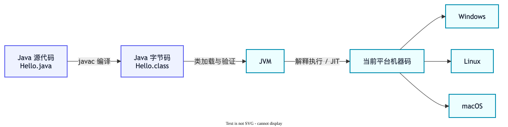

# Java 基础面试题

本章先建立 Java 的基本认识：程序如何运行、对象如何比较、字符串为什么不可变，以及异常和泛型解决了什么问题。

## 运行机制与面向对象

### 1. JDK、JRE 和 JVM 有什么区别？

**面试一句话：** JVM 负责运行 Java 字节码，JRE 提供运行 Java 程序所需的环境，JDK 则在 JRE 基础上增加了编译、调试等开发工具。

可以把它们理解成做饭：

- **JVM** 是灶台，真正负责把程序运行起来。
- **JRE** 是厨房，除了灶台，还有运行程序需要的基础类库。
- **JDK** 是完整厨具套装，既能做饭，也有编译器、调试器等开发工具。

现在常用的 JDK 已经自带运行环境，实际安装时通常只需要安装 JDK。

### 2. Java 程序是怎样运行起来的？

**面试一句话：** `javac` 先把 `.java` 源码编译为平台无关的 `.class` 字节码，JVM 再通过解释执行和即时编译把字节码转换为当前机器能执行的机器码。



这就是 Java 常说的“一次编译，到处运行”：相同的字节码可以交给 Windows、Linux 或 macOS 上各自的 JVM 运行。

### 3. 面向对象的三大特性是什么？

**面试一句话：** 封装把数据和操作数据的方法放在一起并隐藏细节；继承让子类复用父类能力；多态让同一接口在运行时表现出不同实现。

```java
interface Animal {
    void speak();
}

class Dog implements Animal {
    public void speak() {
        System.out.println("汪汪");
    }
}

class Cat implements Animal {
    public void speak() {
        System.out.println("喵喵");
    }
}
```

调用方只依赖 `Animal`，传入 `Dog` 就汪汪叫，传入 `Cat` 就喵喵叫，这就是多态。它能减少大量 `if-else`，让新增实现时少改原有代码。

### 4. 方法重载和方法重写有什么区别？

**面试一句话：** 重载是在同一个类中使用相同方法名和不同参数列表，编译期决定调用哪个；重写是子类重新实现父类方法，运行期根据实际对象选择实现。

| 对比项 | 重载（Overload） | 重写（Override） |
| --- | --- | --- |
| 发生位置 | 通常在同一个类中 | 父子类之间 |
| 方法名 | 相同 | 相同 |
| 参数列表 | 必须不同 | 必须相同 |
| 决定时机 | 编译期 | 运行期 |
| 作用 | 同一操作支持不同参数 | 子类改变父类行为 |

仅修改返回值不能构成重载，因为调用时编译器无法只根据返回值判断该选哪个方法。

### 5. 接口和抽象类有什么区别？

**面试一句话：** 抽象类适合表达“它是什么”和复用公共状态、代码；接口适合表达“它能做什么”和定义能力规范，一个类可以实现多个接口，但只能继承一个类。

例如 `Dog` 是一种 `Animal`，可以继承抽象类；同时它可以实现 `Runnable`、`Swimmable` 等多个能力接口。

接口从 Java 8 开始可以有 `default` 和 `static` 方法，但它仍然不适合保存对象的可变实例状态。实际设计时优先面向接口编程，只在确实需要共享状态或公共实现时使用抽象类。

## 对象与字符串

### 6. `==` 和 `equals()` 有什么区别？

**面试一句话：** 基本类型使用 `==` 比较值；引用类型使用 `==` 比较是否指向同一个对象，而 `equals()` 通常用来比较对象内容是否相等。

```java
String a = new String("Java");
String b = new String("Java");

System.out.println(a == b);      // false，不是同一个对象
System.out.println(a.equals(b)); // true，内容相同
```

`Object` 默认的 `equals()` 仍然比较对象身份。自定义类如果要按内容比较，需要重写 `equals()`。

### 7. 为什么重写 `equals()` 时也要重写 `hashCode()`？

**面试一句话：** Java 约定两个对象只要 `equals()` 相等，它们的 `hashCode()` 就必须相等，否则哈希集合可能把两个逻辑相同的对象放进不同位置。

HashMap 会先用哈希值定位“抽屉”，再用 `equals()` 核对对象。如果两个相等对象算出不同哈希值，它们会进入不同抽屉，导致查找或去重异常。

反过来不成立：哈希值相同的两个对象，`equals()` 不一定相等，这种情况叫 **哈希冲突**。

### 8. 为什么 `String` 是不可变的？

**面试一句话：** String 创建后内容不能修改，拼接等操作会产生新对象；不可变设计有利于常量池复用、线程安全、哈希值缓存和安全性。

```java
String text = "Java";
text = text + " 面试";
```

这里不是修改原来的 `"Java"`，而是创建新字符串，再让 `text` 指向新对象。变量可以重新赋值，不代表原对象内部发生了修改。

### 9. `String`、`StringBuilder` 和 `StringBuffer` 怎么选？

| 类型 | 能否修改内容 | 线程安全 | 常见场景 |
| --- | --- | --- | --- |
| `String` | 不能，修改会产生新对象 | 因不可变而安全 | 少量字符串、固定文本 |
| `StringBuilder` | 能 | 否 | 单线程中频繁拼接，优先使用 |
| `StringBuffer` | 能 | 是，方法带同步 | 多线程共享同一个字符串缓冲区 |

**面试一句话：** 少量拼接直接使用 String；循环或大量拼接优先使用 StringBuilder；只有确实需要多个线程共享同一个缓冲区时才考虑 StringBuffer。

## 异常与泛型

### 10. Java 的异常体系是怎样的？

**面试一句话：** `Throwable` 分为 `Error` 和 `Exception`；Error 多表示 JVM 或系统级严重问题；Exception 又分为受检异常和运行时异常。

```text
Throwable
├── Error                 例如 OutOfMemoryError
└── Exception
    ├── 受检异常           例如 IOException
    └── RuntimeException  例如 NullPointerException
```

- **受检异常**：编译器要求捕获或在方法签名上声明抛出。
- **运行时异常**：编译器不强制处理，常由参数错误、空指针或越界等编程问题引起。

不要用空 `catch` 把异常“吃掉”。至少应保留上下文并记录日志，或转换为当前业务能理解的异常。

### 11. `final`、`finally`、`finalize` 有什么区别？

**面试一句话：** final 是限制修改、继承或重写的关键字；finally 是异常处理中的收尾代码块；finalize 是已经弃用且执行时机不可靠的旧式回收回调。

- `final` 是关键字：可修饰类、方法和变量，分别表示不能继承、不能重写、只能赋值一次。
- `finally` 是异常处理代码块：通常用于释放资源，但文件、连接等资源更推荐使用 `try-with-resources`。
- `finalize()` 是 Object 的旧式回收回调：执行时机不可靠，已经被弃用，不应依赖它释放资源。

`final` 修饰引用，只代表引用不能指向另一个对象，不代表对象内部内容不可修改。

### 12. 泛型有什么用？什么是类型擦除？

**面试一句话：** 泛型把类型检查提前到编译期，减少强制类型转换；Java 泛型主要通过类型擦除实现，很多具体类型信息在编译后会被擦除。

```java
List<String> names = new ArrayList<>();
names.add("小明");
// names.add(123); // 编译失败，提前发现错误
```

因为类型擦除，运行时通常不能直接写 `new T()`，也不能使用 `obj instanceof List<String>`。`List<String>` 和 `List<Integer>` 在运行时通常都是同一个 `List` 类型。

### 13. Java 是值传递还是引用传递？

**面试一句话：** Java 只有值传递；传基本类型时复制的是具体数值，传对象时复制的是引用的值，因此方法能修改同一个对象的内部状态，却不能让调用方的变量改为指向另一个对象。

```java
void rename(User user) {
    user.setName("小明"); // 调用方能看到对象内容改变
    user = new User("小红"); // 只改变当前方法里的引用副本
}
```

“传对象后能修改对象”不等于引用传递。方法拿到的是一份引用副本，只是两份引用暂时指向同一个对象。

### 14. 自动装箱、拆箱和 Integer 缓存有什么坑？

**面试一句话：** 自动装箱会把基本类型转换为包装类型，拆箱则相反；包装类型是对象，使用 `==` 可能受到缓存影响，业务比较应优先使用 `equals()`，拆箱前还要防止 null。

```java
Integer a = 127;
Integer b = 127;
Integer c = 128;
Integer d = 128;

System.out.println(a == b); // 常见实现中为 true
System.out.println(c == d); // 常见实现中为 false
```

这里比较的是对象身份，不应依赖缓存范围判断业务相等。`Integer value = null; int number = value;` 还会因为自动拆箱抛出 `NullPointerException`。

### 15. 浅拷贝和深拷贝有什么区别？

**面试一句话：** 浅拷贝只复制对象本身及其字段值，引用字段仍指向原来的子对象；深拷贝还会复制需要独立的子对象，因此修改副本不会影响原对象。

是否需要深拷贝取决于业务边界。不可变对象通常可以安全共享；对可变集合或可变成员，如果副本必须完全独立，就要显式复制。不要默认使用 Java 原生序列化做深拷贝，它通常性能较差，也会增加类型约束和安全风险。

### 16. 泛型中的 `? extends` 和 `? super` 怎么理解？

**面试一句话：** `? extends T` 适合从容器读取 T，通常不能安全写入；`? super T` 适合向容器写入 T，读取时通常只能当作 Object，这就是 PECS：生产者 extends，消费者 super。

```java
void copy(List<? extends Number> source,
          List<? super Number> target) {
    for (Number number : source) {
        target.add(number);
    }
}
```

这里 `source` 负责生产 Number，`target` 负责消费 Number。通配符限制的是“当前引用能安全做什么”，不是简单地给集合建立继承关系。

## 反射、注解与资源管理

### 17. 什么是反射？它有什么优缺点？

**面试一句话：** 反射允许程序在运行时获取类、字段、方法和构造器信息，并动态创建对象或调用方法；它提升了框架的通用性，但会降低静态类型检查能力，也有性能、封装和可维护性成本。

Spring 的依赖注入、ORM 映射、测试框架都大量使用反射。业务代码不应为了“灵活”到处反射；能通过接口、多态或明确工厂完成时，通常更容易理解和重构。

### 18. 注解的作用是什么？自定义注解怎样生效？

**面试一句话：** 注解是附加在代码上的结构化元数据，本身通常不直接执行业务逻辑；编译器、注解处理器或运行时框架读取它后，相关功能才会生效。

- `@Target` 限定注解可以放在哪里。
- `@Retention` 决定注解保留到源码、class 文件还是运行时。
- 运行时注解通常由框架通过反射读取。

例如只定义一个 `@Audit` 不会自动记录审计日志，还需要拦截器、AOP 或其他处理程序识别它并执行逻辑。

### 19. `try-with-resources` 为什么比手动关闭资源更可靠？

**面试一句话：** try-with-resources 会自动关闭实现了 AutoCloseable 的资源，即使业务代码抛出异常也能执行关闭；多个资源按声明的相反顺序关闭，还能保留主要异常和被抑制的关闭异常。

```java
try (InputStream input = Files.newInputStream(path)) {
    return input.readAllBytes();
}
```

与手写 `finally` 相比，它更不容易漏关资源，也避免关闭异常覆盖真正的业务异常。数据库连接、文件流等资源都应优先使用这种写法或由框架统一托管。

---

[下一章：Java 集合 →](./collections)
