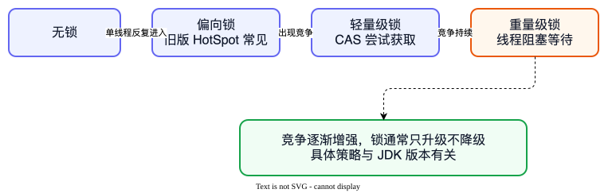
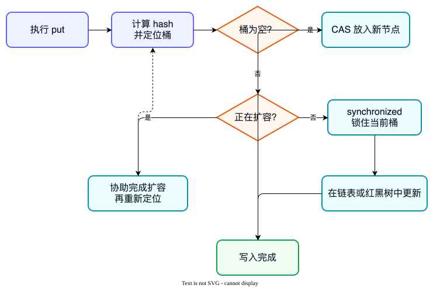

# Java 并发面试题

并发关注的是：多个执行单元同时操作共享数据时，怎样保证结果仍然正确。先理解问题，再选择锁、volatile、CAS 等工具。

::: tip 本章边界
本章讲的是“共享数据怎样保证正确”，重点是 JMM、锁、CAS、AQS 和并发容器。线程怎样创建、切换、停止和放入线程池，放在下一章“多线程”中。
:::

## 并发的三个核心问题

### 1. 什么是线程安全？

**面试一句话：** 多个线程同时访问共享数据时，程序仍能得到符合预期的结果，就叫线程安全；核心问题通常是原子性、可见性和有序性。

- **原子性**：一个操作要么全部完成，要么完全没发生。
- **可见性**：一个线程修改数据后，其他线程能及时看到。
- **有序性**：程序结果不能被不安全的指令重排破坏。

例如 `count++` 看起来只有一行，实际包含“读取、加一、写回”三步。两个线程可能都读到 10，最后都写回 11，于是丢失一次更新。

### 2. 什么是 Java 内存模型（JMM）？

**面试一句话：** JMM 是 Java 对多线程读写共享变量所制定的一组规则，它描述线程怎样与主内存交互，以及什么情况下一个线程的写入对另一个线程可见。

可以把主内存理解成公共白板，每个线程手里还有自己的草稿纸。如果没有同步规则，一个线程在草稿纸上改了数字，其他线程不一定马上看到。

JMM 不是 JVM 运行时内存区域的划分。前者讲并发读写规则，后者讲堆、栈、方法区等存储区域。

### 3. 什么是 happens-before？

**面试一句话：** happens-before 是 JMM 判断可见性和有序性的规则；如果操作 A happens-before 操作 B，那么 B 必须能看到 A 的结果，并且 A 的执行效果排在 B 之前。

常见规则包括：

- 解锁 happens-before 后续对同一把锁的加锁。
- 对 volatile 变量的写 happens-before 后续对它的读。
- 启动线程前的操作 happens-before 被启动线程中的操作。
- 线程中的操作 happens-before 其他线程从 `join()` 成功返回。

它表达的是执行效果上的先后保证，不等于两个操作一定在现实时间上紧挨着执行。

## 锁与可见性

### 4. `synchronized` 和 `ReentrantLock` 有什么区别？

**面试一句话：** 两者都能提供互斥和可见性；synchronized 语法简单、退出代码块时自动释放锁，ReentrantLock 支持可中断等待、超时尝试、公平锁和多个条件队列，但必须在 finally 中手动释放。

```java
lock.lock();
try {
    // 修改共享数据
} finally {
    lock.unlock();
}
```

没有特殊能力需求时优先使用 `synchronized`；需要 `tryLock()`、公平性或精细条件控制时再使用 `ReentrantLock`。

### 5. `synchronized` 的锁升级是什么？

**面试一句话：** 在部分 HotSpot 版本中，synchronized 会根据竞争情况使用偏向锁、轻量级锁或重量级锁等状态，目的是让低竞争时少阻塞、竞争激烈时再让线程进入等待；具体策略必须结合 JDK 版本说明。



小白可以把它理解成排队方式逐渐变严格：一个人使用时只做简单登记；少量人竞争时先快速尝试；竞争持续时再进入真正的阻塞队列。

偏向锁属于版本相关实现细节，现代 JDK 已发生变化。面试时先讲“JVM 会根据竞争程度优化锁”，不要把 JDK 8 的状态和阈值说成所有版本永远不变。

### 6. `volatile` 有什么作用？能保证 `count++` 安全吗？

**面试一句话：** volatile 能保证变量修改对其他线程可见，并限制相关指令重排，但不能保证复合操作的原子性，所以不能单独保证 `count++` 线程安全。

volatile 适合“一写多读”的状态标记，例如停止标志：

```java
private volatile boolean running = true;

public void stop() {
    running = false;
}
```

计数场景可根据竞争程度使用 `AtomicInteger`、`LongAdder` 或锁。

### 7. CAS 是什么？有什么问题？

**面试一句话：** CAS 会比较内存中的实际值是否仍等于预期值，相等才更新，否则失败重试；它能减少阻塞，但可能产生忙等开销和 ABA 问题。

例如线程认为余额仍是 100，就尝试把它改成 80；如果期间余额已经变成 90，比较失败，线程需要重新读取并计算。

**ABA 问题** 是值从 A 变成 B 又变回 A，CAS 只看当前值会误以为从未改变。需要识别变化过程时，可以增加版本号，例如使用 `AtomicStampedReference`。

### 8. AtomicInteger 和 LongAdder 有什么区别？

**面试一句话：** AtomicInteger 通常通过 CAS 更新一个值，能直接得到精确当前值；LongAdder 在高竞争下把更新分散到多个槽位，最后汇总，因此吞吐量通常更好，但读取瞬间不适合要求严格原子快照的场景。

- 低竞争计数、需要 `compareAndSet()`：优先考虑 `AtomicInteger`。
- 高并发统计请求量、成功次数：可以考虑 `LongAdder`。
- 账户余额等带业务约束的更新：不能只因为性能就直接改用 LongAdder，还要保证整体业务原子性。

## 线程隔离与并发容器

### 9. ThreadLocal 是什么？为什么可能内存泄漏？

**面试一句话：** ThreadLocal 为每个线程保存一份独立变量，适合保存一次请求内的上下文；在线程池中使用后必须及时 remove，否则线程长期存活时，关联值也可能长期无法释放或污染后续请求。

```java
try {
    USER_CONTEXT.set(currentUser);
    handleRequest();
} finally {
    USER_CONTEXT.remove();
}
```

ThreadLocal 不是把对象复制一份，而是把值放进当前线程自己的 ThreadLocalMap。它解决的是线程隔离，不是线程之间共享数据。

### 10. ConcurrentHashMap 为什么适合并发场景？

**面试一句话：** ConcurrentHashMap 通过更细粒度的同步和 CAS 等机制，让多个线程可以并发访问不同位置，避免像 Hashtable 那样把所有常用操作都串行化。

以常见 JDK 8 实现为例，读取通常不加互斥锁，写入会结合 CAS 和桶级 synchronized。具体实现随 JDK 版本变化，面试时先讲“线程安全 + 更高并发度”。



即使容器线程安全，多步业务逻辑也不一定原子。例如：

```java
map.putIfAbsent(key, value); // 比 containsKey 后再 put 更适合并发场景
```

### 11. AQS 是什么？

**面试一句话：** AQS 是 AbstractQueuedSynchronizer 的简称，它用一个同步状态和一条等待队列，为 ReentrantLock、Semaphore、CountDownLatch 等同步工具提供通用基础能力。

可以把 AQS 理解成“取号排队框架”：

- `state` 表示资源当前是否可用，或者还剩多少份。
- 获取失败的线程进入等待队列。
- 资源释放后，框架按规则唤醒后续线程继续尝试。

AQS 不等于某一把具体的锁。它负责排队、阻塞和唤醒等通用机制，具体工具再决定怎样解释 `state`、是否允许多个线程同时成功等规则。

---

[← 上一章：Java 集合](./collections) · [下一章：多线程 →](./multithreading)
