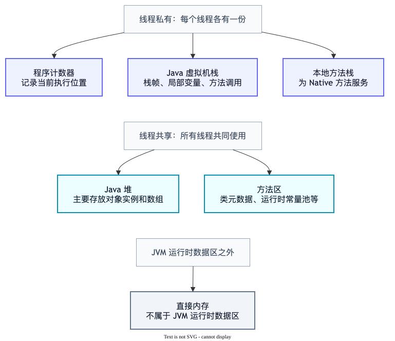
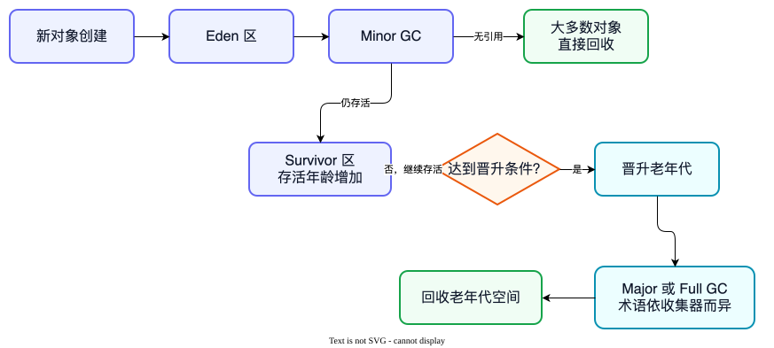
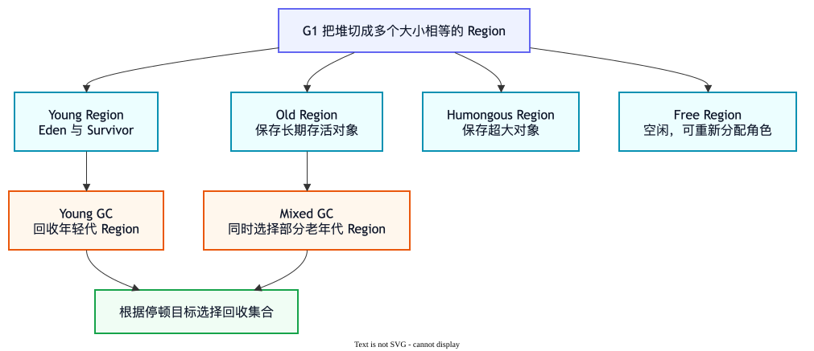
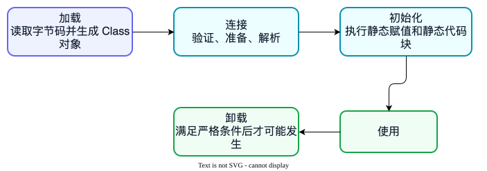

# JVM 面试题

JVM 负责加载并运行 Java 字节码。本章从内存区域开始，再解释垃圾回收、类加载和调优思路。

## 内存区域

### 1. JVM 运行时内存区域有哪些？

**面试一句话：** 堆和方法区由线程共享，主要存放对象实例、类元数据等；程序计数器、虚拟机栈和本地方法栈是线程私有的，记录每个线程自己的执行状态。

“对象都在堆上”适合作为入门理解，但 JIT 可能通过逃逸分析做标量替换等优化，因此不能把它当成绝对规则。

### 2. 堆和栈有什么区别？

**面试一句话：** 堆由线程共享，主要保存对象并由垃圾回收器管理；Java 虚拟机栈是线程私有的，方法调用时创建栈帧，方法结束后栈帧出栈。

| 对比项 | 堆 | Java 虚拟机栈 |
| --- | --- | --- |
| 是否共享 | 线程共享 | 每个线程私有 |
| 主要内容 | 对象实例、数组 | 方法调用对应的栈帧、局部变量等 |
| 生命周期 | 通常由垃圾回收器管理 | 方法调用入栈，结束后出栈 |
| 常见错误 | OutOfMemoryError | StackOverflowError，也可能 OOM |

递归调用层数过深，栈帧不断增加，容易发生 `StackOverflowError`；大量对象长期无法回收，可能导致堆 `OutOfMemoryError`。

### 3. 什么情况下会发生内存泄漏？

**面试一句话：** Java 有垃圾回收不代表不会内存泄漏；如果不再需要的对象仍被有效引用，GC 就不能回收它，长期积累后可能 OOM。

常见例子：

- 无上限的静态 Map 或本地缓存不断保存对象。
- 监听器注册后没有注销。
- 线程池中的 ThreadLocal 使用后没有清理。
- 连接、流或直接内存资源没有正确关闭。

排查时通常先看监控和 GC 日志，再获取堆转储，通过支配树、引用链等信息查找是谁一直持有对象。

## 垃圾回收

### 4. JVM 怎样判断对象可以被回收？

**面试一句话：** HotSpot 等主流 JVM 实现使用可达性分析：从 GC Roots 出发沿引用链查找，无法到达的对象才有资格被回收。

常见 GC Roots 包括线程栈中的局部变量引用、类的静态字段引用、JNI 引用等。

单纯引用计数难以处理循环引用：两个对象可以互相引用，但外部已经无法访问它们。可达性分析能够识别这种情况。

### 5. 什么是 Minor GC、Major GC 和 Full GC？

**面试一句话：** Minor GC 通常回收年轻代；Major GC 常指老年代回收，但术语在不同收集器和工具中可能不完全一致；Full GC 通常涉及整个堆，停顿往往更明显。

小白可以先记住：大多数新对象先进入年轻代，而且很快就不再使用；少数多次回收后仍存活的对象，才可能晋升到老年代。实际晋升条件和区域组织方式取决于收集器与 JVM 参数。

排查频繁 GC 时，不要只盯次数，还要结合暂停时间、对象分配速率、晋升速率、堆大小和 GC 日志。常见原因包括短时间创建大量对象、缓存无上限、大对象分配或内存泄漏。

### 6. 什么是 Stop The World？

**面试一句话：** Stop The World，简称 STW，是 JVM 暂停应用线程的阶段；垃圾回收的某些步骤需要在一致状态下处理对象关系，因此无法完全避免暂停。

不同垃圾收集器会尽量把更多工作并发完成，但“并发收集”不等于完全没有 STW。线上关注的是暂停频率、最大暂停时间和业务延迟是否达标。

### 7. G1 垃圾收集器有什么特点？

**面试一句话：** G1 把堆划分为多个大小相等的 Region，根据垃圾收益和停顿目标选择一部分 Region 回收；它仍有年轻代和老年代概念，但这些区域在物理上不要求连续。

G1 的核心不是“完全没有停顿”，而是尽量预测并控制每次回收的工作量。Young GC 主要处理年轻代 Region，Mixed GC 还会选择部分老年代 Region 一起回收。

## 类加载与调优

### 8. 类加载过程有哪些阶段？

**面试一句话：** 类的生命周期通常包括加载、验证、准备、解析、初始化、使用和卸载；其中验证、准备、解析合称连接。

- **加载**：读取字节码并生成 Class 对象。
- **验证**：检查字节码是否符合规范和安全要求。
- **准备**：为类变量分配内存并设置初始零值。
- **解析**：把常量池中的符号引用转换为直接引用。
- **初始化**：执行静态变量赋值和静态代码块。

“准备阶段设置零值”和“初始化阶段执行代码中的赋值”是常见追问点。

### 9. 什么是类加载器的双亲委派？

**面试一句话：** 类加载器收到加载请求后，通常先委托父加载器尝试，父加载器无法完成时自己再加载；这样能避免核心类被重复或恶意替换。

例如应用自己写一个 `java.lang.String`，正常情况下也不会替换 JDK 提供的 String。

双亲委派是一种通用规则，并非永远不能打破。SPI、应用服务器、模块化和热部署等场景可能使用不同的类加载机制。

### 10. JVM 调优的基本思路是什么？

**面试一句话：** JVM 调优先明确吞吐量、延迟或内存目标，再通过监控、GC 日志、线程转储和堆转储定位瓶颈，最后小步修改并用同等流量验证，不能只靠调大堆内存。

一个可复用的排查顺序：

1. 确认现象：响应慢、CPU 高、频繁 GC，还是 OOM。
2. 收集证据：监控指标、GC 日志、`jstack`、`jmap` 或飞行记录。
3. 判断根因：对象分配过快、缓存泄漏、锁竞争、死循环或外部依赖慢。
4. 优先修复代码和容量问题，再考虑堆大小、收集器等参数。
5. 在压测或灰度环境验证，并准备回滚方案。

---

[← 上一章：多线程](./multithreading) · [返回学习目录](./question)
