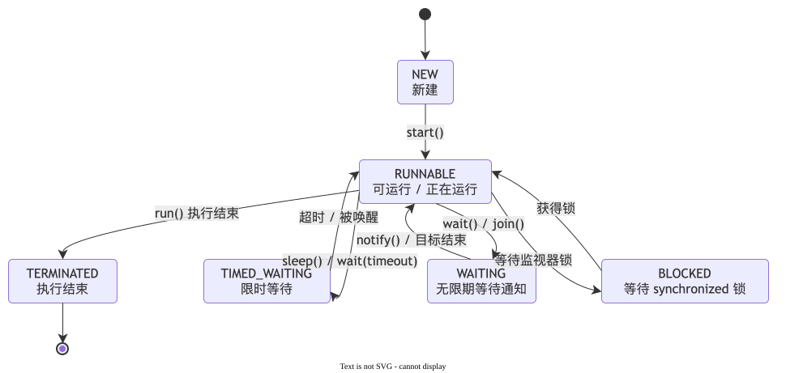
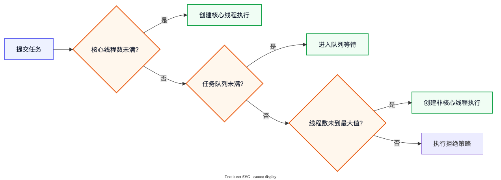

# Java 多线程面试题

多线程关注线程本身的创建、状态、协作和管理。生产代码的重点不是“会 new Thread”，而是能控制线程数量、处理异常并安全停止任务。

::: tip 本章边界
本章讲的是“线程怎样被创建、协作和管理”。如果问题在问共享变量为什么看不见、锁怎样保证原子性、CAS 或 AQS 的原理，应回到上一章“并发”。
:::

## 线程基础

### 1. 进程和线程有什么区别？

**面试一句话：** 进程是操作系统分配资源的基本单位，线程是 CPU 调度的基本单位；同一进程内的线程共享堆等资源，但每个线程有自己的程序计数器和虚拟机栈。

可以把进程理解成一家餐厅，线程是餐厅里的厨师。厨师共享厨房和食材，但每个人有自己的工作步骤。共享提高了协作效率，也带来了数据竞争问题。

### 2. 创建线程有哪些方式？推荐哪一种？

常见写法包括继承 `Thread`、实现 `Runnable`、使用 `Callable + Future`，以及把任务提交给线程池。

**面试一句话：** 生产代码更推荐把任务与线程分离，通过线程池执行 Runnable 或 Callable；这样能复用线程、限制并发量并统一管理生命周期。

直接为每个任务创建线程会产生创建、销毁和上下文切换开销，任务突增时还可能耗尽内存。

### 3. `start()` 和 `run()` 有什么区别？

**面试一句话：** 调用 `start()` 会请求 JVM 创建并调度一个新线程，新线程随后执行 `run()`；直接调用 `run()` 只是当前线程的一次普通方法调用，不会产生新线程。

```java
Thread worker = new Thread(() ->
    System.out.println(Thread.currentThread().getName())
);

worker.start(); // 在新线程执行
// worker.run(); // 在当前线程直接执行
```

同一个 Thread 对象只能成功启动一次，重复调用 `start()` 会抛出 `IllegalThreadStateException`。

### 4. Java 线程有哪些状态？

**面试一句话：** Java 定义了 NEW、RUNNABLE、BLOCKED、WAITING、TIMED_WAITING 和 TERMINATED 六种线程状态；操作系统层面的“正在运行”和“可运行”在 Java 中通常都归入 RUNNABLE。



- **BLOCKED**：等待进入 synchronized 保护的区域。
- **WAITING**：无限期等待其他线程唤醒，例如 `wait()`、`join()`。
- **TIMED_WAITING**：带超时时间地等待，例如 `sleep()`、`wait(timeout)`。

## 线程协作

### 5. `sleep()` 和 `wait()` 有什么区别？

| 对比项 | `Thread.sleep()` | `Object.wait()` |
| --- | --- | --- |
| 所属类 | Thread | Object |
| 是否需要持有监视器 | 不需要 | 必须在 synchronized 中持有对象监视器 |
| 是否释放锁 | 不释放已持有的锁 | 会释放对应对象的监视器锁 |
| 如何恢复 | 时间到或被中断 | notify、notifyAll、超时或被中断 |

**面试一句话：** sleep 用于让当前线程暂停一段时间，不会释放锁；wait 用于线程间协作，会释放对应的监视器锁。

现代业务代码中，更常使用 `BlockingQueue`、`CountDownLatch`、`Condition` 等更高层工具表达协作关系。

### 6. 怎样正确停止一个线程？

**面试一句话：** 通常使用中断机制请求线程停止：调用方执行 `interrupt()`，任务通过中断标记或 `InterruptedException` 感知请求，清理资源后自行退出。

```java
while (!Thread.currentThread().isInterrupted()) {
    doOneTask();
}
```

中断是一种协作信号，不是强制杀死线程。捕获 `InterruptedException` 后如果不能立即退出，通常应重新设置中断标记，避免把停止信号吃掉。

### 7. 什么是线程上下文切换？

**面试一句话：** CPU 从一个线程切换到另一个线程时，需要保存前一个线程的执行现场并恢复后一个线程的现场，这就是上下文切换；线程过多会增加调度和缓存失效成本。

线程不是越多越快。CPU 密集任务的线程数通常接近可用核心数；I/O 密集任务可以适当更多，但仍要结合等待时间、内存、下游容量和压测结果决定。

## 线程池

### 8. 线程池的核心参数有哪些？任务如何执行？

**面试一句话：** 重点参数包括核心线程数、最大线程数、空闲存活时间、任务队列、线程工厂和拒绝策略；提交任务后通常先使用核心线程，再进入队列，队列满后创建非核心线程，最后触发拒绝策略。



最容易记错的是顺序：达到核心线程数后，任务通常先排队；只有队列也放不下时，才继续创建线程直到最大线程数。线程和队列都到上限后，才会执行拒绝策略。

参数必须结合任务类型、耗时、峰值流量和机器资源压测决定。不要只背“CPU 核数加一”，也不要无脑使用无界队列，否则任务积压可能导致 OOM。

### 9. 线程池有哪些拒绝策略？

JDK 常见的四种策略：

- `AbortPolicy`：直接抛异常，默认策略，能明确暴露过载。
- `CallerRunsPolicy`：让提交任务的线程自己执行，形成一定反压。
- `DiscardPolicy`：静默丢弃当前任务。
- `DiscardOldestPolicy`：丢弃队列中最旧任务，再尝试提交。

**面试一句话：** 拒绝策略不能脱离业务选择；支付、订单等任务通常不能静默丢弃，还要配合告警、降级、持久化或重试机制。

### 10. 什么是死锁？怎样避免和排查？

**面试一句话：** 多个线程各自持有一部分资源，又互相等待对方释放资源，形成循环等待，就发生了死锁。

最直观的例子：线程 A 拿着锁 1 等锁 2，线程 B 拿着锁 2 等锁 1。

常见处理方式：

1. 所有线程按相同顺序获取锁。
2. 减少锁的范围和持有时间。
3. 使用 `tryLock()` 设置超时，失败后释放已持有资源。
4. 避免持锁期间进行网络请求、数据库慢查询等耗时操作。
5. 通过 `jstack`、线程转储或监控查找互相等待的线程和锁。

---

[← 上一章：并发](./concurrency) · [下一章：JVM →](./jvm)
